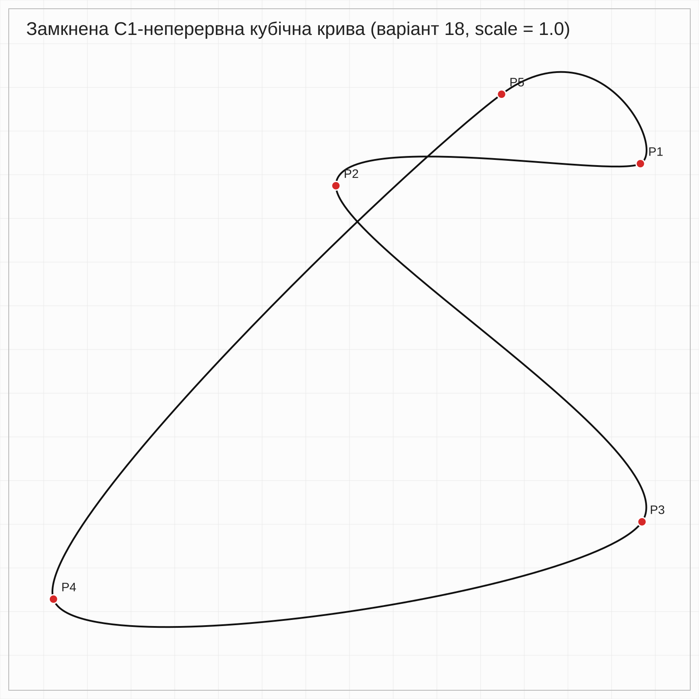
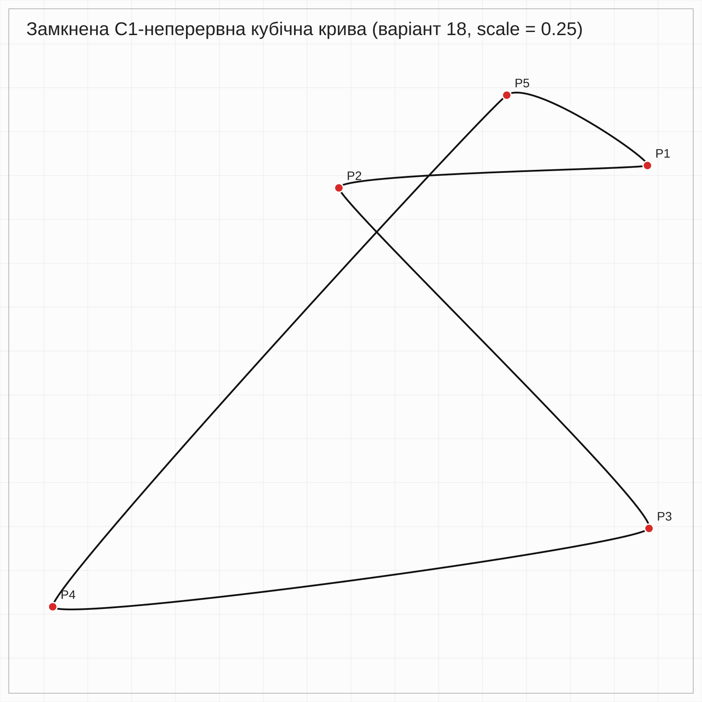
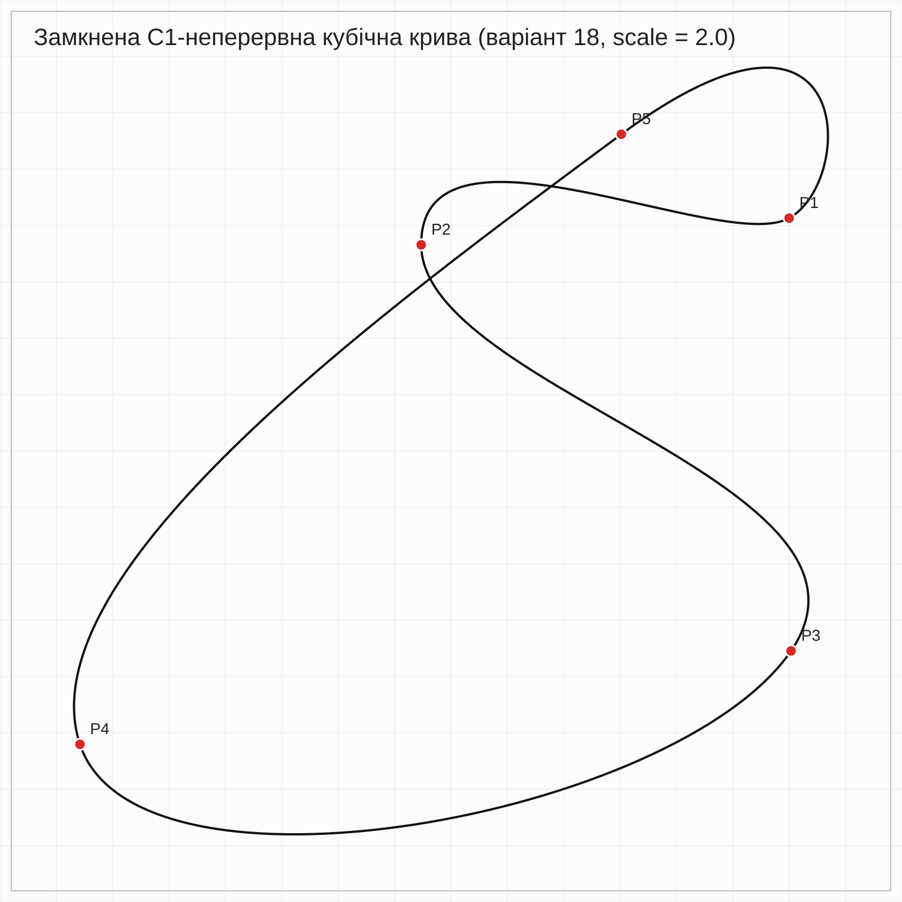

# Laboratory Work No. 1  
## Construction of a C1-Continuous Piecewise Cubic Curve

This repository contains the implementation of Laboratory Work No. 1 for the course  
**Algorithms and Data Structures in 3D Printing Tasks**.

The goal of the work is to construct a closed parametric curve that passes through five given points, consists of cubic polynomial segments, and has **C1 continuity**, i.e., continuity of the first derivative at the joining points.

The implementation is written in **Python** and exports the result to **SVG format**.

---

## Task Description

For the selected variant, five interpolation points are given. It is required to construct a closed continuous curve passing through all these points such that each section between adjacent points is described by a cubic polynomial. The segments must be connected with C1 continuity.

In this work, the curve is constructed using the **cubic Hermite representation**, which is then converted into **cubic Bézier curves** for SVG output.

---

## Variant 18

The following points are used:

- P1 = (437, 153)  
- P2 = (244, 167)  
- P3 = (438, 380)  
- P4 = (65, 429)  
- P5 = (349, 109)

---

## Mathematical Model

Each segment is defined using the Hermite form:

C(u) = h₀₀(u)P₀ + h₁₀(u)T₀ + h₀₁(u)P₁ + h₁₁(u)T₁,  u ∈ [0,1]

where:

h₀₀(u) = 2u³ − 3u² + 1  
h₁₀(u) = u³ − 2u² + u  
h₀₁(u) = −2u³ + 3u²  
h₁₁(u) = u³ − u²  

The tangent vectors are computed as:

Tᵢ = k · (Pᵢ₊₁ − Pᵢ₋₁) / 2

where k is a scaling coefficient controlling the tangent length.

For SVG rendering, Hermite curves are converted into Bézier curves:

B₁ = P₀ + T₀ / 3  
B₂ = P₁ − T₁ / 3  

---

## Project Structure
Algorithms and structures in 3D/

│   
├── .venv/  
├── lab1.py     
├── lab1_variant18.svg  
├── lab1_variant18_small.svg    
└── lab1_variant18_large.svg


---

## Implementation

The program defines interpolation points and computes tangent vectors based on neighboring points. This ensures smooth transitions between segments and guarantees C1 continuity.

Each segment is constructed using cubic Hermite interpolation. Then it is transformed into Bézier representation and written into an SVG path.

To improve visualization, the program samples points along the curve, computes its bounding box, and applies automatic scaling and translation so that the curve fits the entire canvas.

---

## How to Run

Run the program:

```bash
python lab1.py
```

After execution, three SVG files will be generated:

lab1_variant18.svg
lab1_variant18_small.svg
lab1_variant18_large.svg

---

## Results
Base curve



Small tangent length



Large tangent length



---

## Experiment

An experiment was conducted to analyze the influence of tangent vector length on the shape of the curve.

When the tangent length is reduced, the curve becomes more rigid and approaches a polyline. The influence of the derivative decreases, and segments become closer to straight lines.

When the tangent length is increased, the curve becomes more flexible and develops stronger bends. Moderate values improve smoothness, but large values may cause overshooting and self-intersections.

Thus, the tangent length acts as a shape control parameter.

---

## Conclusion

A closed C1-continuous piecewise cubic curve passing through five given points was successfully constructed. The implementation is based on cubic Hermite interpolation and conversion to Bézier curves for SVG rendering.

The experiment confirmed that tangent vector length significantly affects the geometric properties of the curve and must be chosen carefully.

## Author

Student of group TR-52mp Andrii Khavkin

Laboratory Work No. 1

Course: Algorithms and Data Structures in 3D Printing Tasks