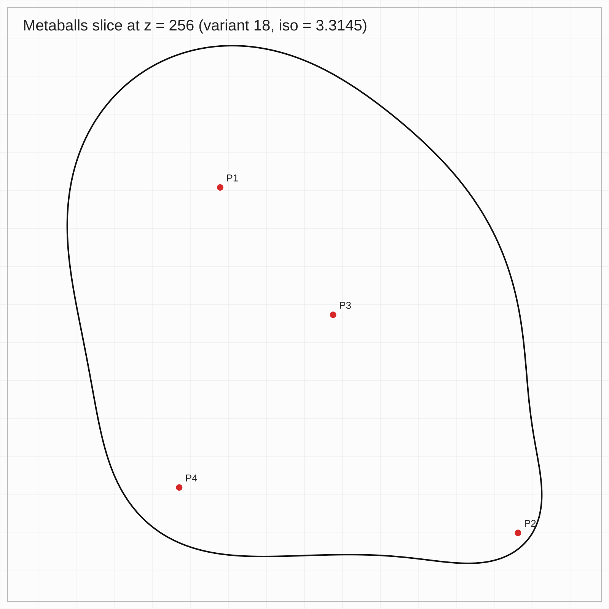
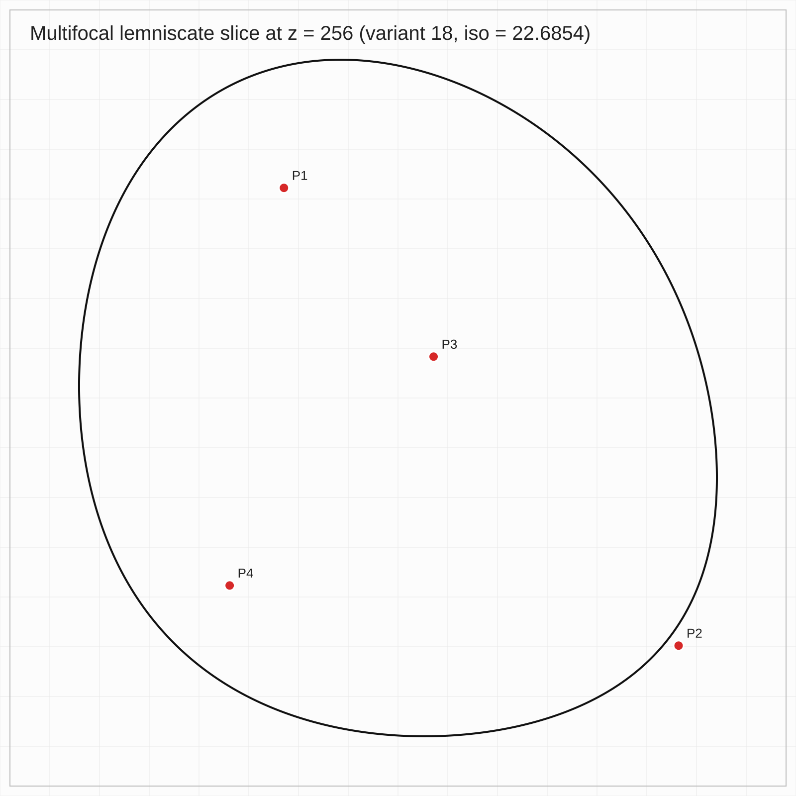

# Laboratory Work No. 2  
## Construction of Implicit Surfaces and Their Section

This repository contains the implementation of Laboratory Work No. 2 for the course  
**Algorithms and Data Structures in 3D Printing Tasks**.

The goal of the work is to construct two implicit surfaces based on a given set of points and compute their intersection with a plane. The resulting contours are extracted and visualized in **SVG format**.

The implementation is written in **Python**.

---

## Task Description

For the selected variant, a set of points in three-dimensional space is given. It is required to construct two implicit surfaces using different approaches:

- metaballs (sum-based scalar field)
- multifocal lemniscate (distance-based scalar field)

Then, a cross-section of each surface must be computed using a plane:

z = 256

The result is a 2D contour that must be **closed and single-connected**.

---

## Variant 18

The following points are used:

- P1 = (211, 129, 180)  
- P2 = (480, 441, 101)  
- P3 = (313, 244, 273)  
- P4 = (174, 400, 418)

---

## Mathematical Model

The metaballs model is defined as a scalar field:

F(x,y,z) = Σ (R² / ((x-xᵢ)² + (y-yᵢ)² + (z-zᵢ)²))

The surface is obtained as an isosurface of this field.

The multifocal lemniscate is defined using distances to multiple points. In this work, a logarithmic form is used:

F(x,y,z) = Σ log(√((x-xᵢ)² + (y-yᵢ)² + (z-zᵢ)² + α²))

The contour is obtained by fixing z = 256 and computing the isoline:

F(x,y,256) = C

---

## Project Structure

Algorithms and structures in 3D/

│  
├── .venv/  
├── lab2.py  
├── lab2_metaballs_variant18.svg  
└── lab2_lemniscate_variant18.svg  

---

## Implementation

The program constructs scalar fields for both models based on distances to given points. The space is discretized into a regular grid in the plane z = 256.

The contour is extracted using the **Marching Squares algorithm**, which analyzes function values at grid cell vertices and determines where the isoline crosses the cell.

To improve accuracy, linear interpolation is used to find intersection points on cell edges. The resulting segments are merged into polylines, and a single closed contour is selected.

Additionally, the contour is smoothed using Chaikin’s algorithm to obtain a visually smoother curve.

---

## How to Run

Run the program:

```bash
python lab2.py
```
After execution, two SVG files will be generated:

lab2_metaballs_variant18.svg
lab2_lemniscate_variant18.svg

## Results

Metaballs surface section



Multifocal lemniscate section



## Experiment

The experiment demonstrates the difference between two approaches to implicit surface modeling.

The metaballs method produces a shape influenced locally by each point, resulting in more flexible and asymmetric contours.

The multifocal lemniscate produces a smoother and more uniform contour due to the global influence of all points.

## Conclusion

Two implicit surface modeling methods were implemented and analyzed. The cross-sections obtained using Marching Squares satisfy the requirement of being closed and single-connected.

The results show that metaballs provide better local control of shape, while lemniscates produce more stable and smooth contours.

## Author

Student of group TR-52mp
Andrii Khavkin

Laboratory Work No. 2

Course: Algorithms and Data Structures in 3D Printing Tasks