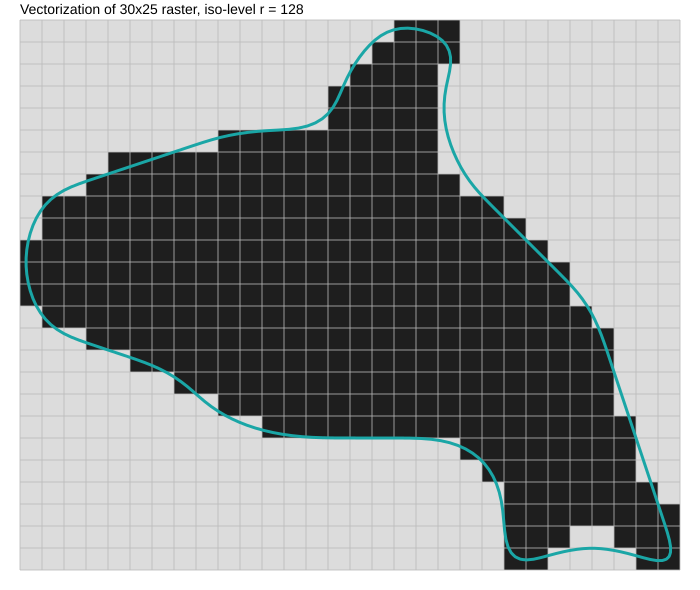

# Laboratory Work No. 3  
## Vectorization of a Raster Image

This repository contains the implementation of Laboratory Work No. 3 for the course  
**Algorithms and Data Structures in 3D Printing Tasks**.

The goal of the work is to perform **vectorization of a grayscale raster image** by extracting its contour and representing it as a set of smooth parametric curves.

The implementation is written in **Python**.

---

## Task Description

A single-channel (grayscale) raster image must be vectorized.

For the selected variant, the image size is fixed:

- width: 30 pixels  
- height: 25 pixels  

The task consists of three main steps:

1. Construct the isoline S of the interpolated raster function f such that:

f(S) = r

where r = 128.

2. Perform vectorization of the image. The result must be represented as a set of connected parametric polynomial curves.

3. Analyze how performance and memory usage depend on image resolution by scaling the raster (2×, 4×, 8×).

---

## Variant 18

- Image size: **30 × 25**
- Threshold level: **r = 128**

---

## Mathematical Model

The raster image is treated as a discrete sampling of a scalar function:

f(x, y)

To obtain a continuous representation, **bilinear interpolation** is assumed within each grid cell.

The contour is defined as an isoline:

f(x, y) = 128

---

## Project Structure

Algorithms and structures in 3D/

│  
├── .venv/  
├── lab3.py  
└── lab3_orca_vectorized.svg  

---

## Implementation

The program generates a grayscale raster image representing a silhouette (orca).

The raster is converted into a binary mask using a threshold value (r = 128). The largest connected component is extracted to isolate the main object.

To avoid selecting internal regions, the external background is determined using a flood-fill algorithm. Based on this, only the **outer boundary** of the object is constructed.

The contour is initially represented as a polyline aligned with the pixel grid. To improve quality:

- the contour is simplified by reducing the number of points,
- Chaikin's algorithm is applied for smoothing,
- additional Laplacian smoothing is used to improve uniformity.

The final contour is approximated using **cubic Bézier curves**, obtained via Catmull–Rom spline conversion.

The result is exported as an **SVG file**.

---

## How to Run

Run the program:

```bash
python lab3.py
```
After execution, the following file will be generated:

lab3_orca_vectorized.svg

--- 

## Results

Vectorized contour (orca silhouette)



--- 

## Experiment

The raster image was scaled by factors of 2, 4, and 8.

The results show that:

the number of contour points increases proportionally to image resolution,
execution time grows approximately with the number of grid cells,
memory usage increases proportionally to the raster size.

This confirms that the computational complexity of the algorithm is approximately O(n²) with respect to image resolution.


--- 
## Conclusion

A complete raster-to-vector pipeline was implemented.

The isoline extraction was performed using a grid-based approach, and the contour was converted into a smooth parametric representation.

The combination of contour simplification, smoothing, and Bézier approximation allows obtaining high-quality vector graphics from low-resolution raster data.

The approach demonstrates a practical method for converting discrete image data into a continuous geometric representation suitable for further processing and visualization.

---

## Author

Student of group TR-52mp
Andrii Khavkin

Laboratory Work No. 3

Course: Algorithms and Data Structures in 3D Printing Tasks