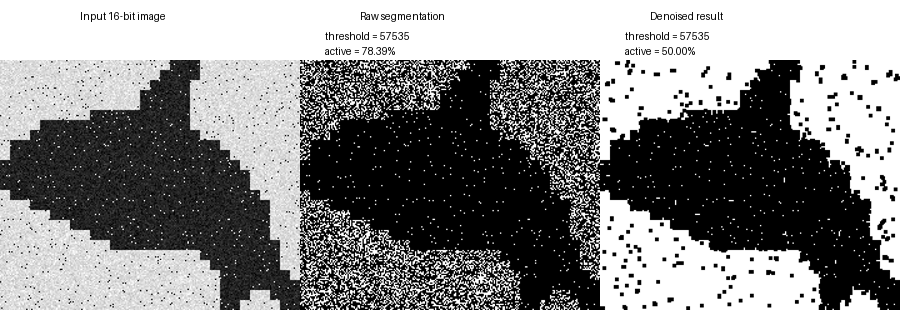
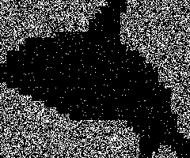
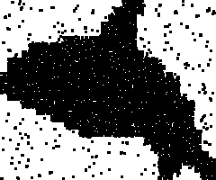

# Лабораторна робота №4  
## Знешумлювання воксельної моделі

### Опис роботи

У цій лабораторній роботі реалізовано алгоритм сегментації та знешумлювання одноканального зображення, яке розглядається як окремий шар воксельної моделі.

Основна мета роботи — виконати порогову сегментацію зображення, застосувати морфологічне знешумлення методом ерозії та дилатації, а також програмно підібрати параметр `threshold` так, щоб після сегментації та знешумлення активними залишилося приблизно 50% усіх вокселів.

Робота виконана для варіанта №18.

- Глибина каналу: `16 біт`
- Умова сегментації для парного варіанта: `value <= threshold`
- Результат експортується у форматі `PGM`
- Для зручності перегляду додатково створюються `PNG`-зображення

---

### Основні етапи алгоритму

Програма виконує такі дії:

1. Формує базове одноканальне зображення на основі силуету касатки.
2. Масштабує зображення для зручнішої візуалізації.
3. Перетворює 8-бітне зображення у 16-бітне.
4. Додає шум до зображення.
5. Програмно підбирає значення `threshold`.
6. Виконує сегментацію за знайденим порогом.
7. Застосовує знешумлення методом:
   - ерозія;
   - дилатація.
8. Підраховує кількість активних вокселів.
9. Зберігає результати у файли `PGM`, `PNG` та `TXT`.

---

### Використані технології

- Python 3
- NumPy
- Pillow

---

### Структура проєкту

```text
Lab4/
│
├── lab4.py
├── output/
│   ├── input_16bit.pgm
│   ├── segmented_raw.pgm
│   ├── segmented_denoised.pgm
│   ├── segmented_raw.png
│   ├── segmented_denoised.png
│   ├── comparison.png
│   └── summary.txt
└── README.md
```
---

### Запуск програми

Перед запуском потрібно встановити залежності:
```
pip install numpy pillow
```

Після цього програму можна запустити командою:
```
python lab4.py
```
Після виконання програми у папці output будуть створені всі результати роботи.

---

### Результати роботи

У результаті виконання програми було автоматично знайдено параметр сегментації:

threshold = 57535

Основні числові результати:
```
Варіант: 18
Глибина каналу: 16 біт
Кількість усіх вокселів: 48000
Активних після сегментації: 37626 (78.39%)
Активних після знешумлення: 24000 (50.00%)
Час підбору threshold: 2.553 мс
Відхилення від 50% після знешумлення: 0.00%
```
Таким чином, після сегментації та знешумлення результат містить рівно половину активних вокселів від загальної кількості елементів зображення.

---

### Візуалізація результатів

Порівняння основних етапів роботи алгоритму:

<p align="center">  </p>

На зображенні показано:

ліворуч — початкове 16-бітне зашумлене зображення;
посередині — результат первинної сегментації;
праворуч — результат після знешумлення методом ерозії-дилатації.

Окремий результат первинної сегментації:

<p align="center">  </p>

Окремий результат після знешумлення:

<p align="center">  </p>

---

### Опис реалізації

Функція segment() виконує порогову сегментацію зображення. Оскільки варіант роботи парний, активними вважаються ті елементи, значення яких менші або дорівнюють знайденому порогу.

Функції erode() та dilate() реалізують морфологічні операції над бінарною маскою з використанням структурного елемента 3x3. Ерозія видаляє дрібні шумові включення, а дилатація частково відновлює основну форму об’єкта.

Функція denoise() виконує знешумлення як послідовність:

```
erosion → dilation
```

Функція find_threshold_for_half_volume() програмно підбирає значення threshold, при якому після сегментації та знешумлення кількість активних вокселів є найближчою до 50% від загальної кількості елементів зображення.

---

### Висновок

У роботі було реалізовано повний цикл обробки одноканального зображення як шару воксельної моделі: сегментацію, морфологічне знешумлення та автоматичний підбір порогового значення.

Отримані результати підтверджують, що метод ерозії-дилатації дозволяє зменшити кількість шумових включень після threshold-сегментації. Програмний підбір порогу забезпечив виконання вимоги завдання: фінальна бінарна модель після знешумлення містить 50% активних вокселів.

Алгоритм працює швидко для використаного розміру зображення, однак для великих воксельних моделей час виконання може суттєво зростати. Основними шляхами оптимізації є використання векторизованих операцій, бінарного пошуку, аналізу гістограми та паралельної обробки шарів.

## Author

Student of group TR-52mp
Andrii Khavkin

Laboratory Work No. 4

Course: Algorithms and Data Structures in 3D Printing Tasks